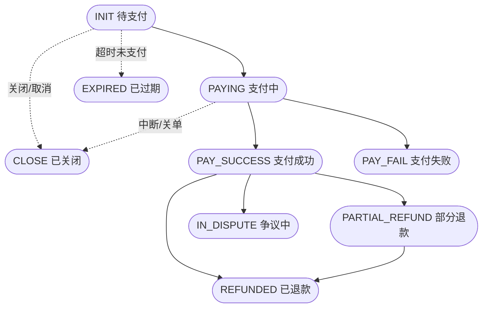

## 订单状态

一笔支付订单在其生命周期中会经历以下状态：

| 状态码 | 状态           | 说明                                         |
| ------ | -------------- | -------------------------------------------- |
| 0      | INIT           | 初始化，订单刚创建，等待用户支付             |
| 1      | PAYING         | 支付中，用户已进入收银台或正在完成支付       |
| 2      | PAY_SUCCESS    | 支付成功，资金已从消费者侧扣除               |
| 3      | PAY_FAIL       | 支付失败，可能是余额不足、卡号错误等         |
| 4      | PARTIAL_REFUND | 部分退款，已退还部分金额                     |
| 5      | REFUNDED       | 全部退款，订单金额已全部退还                 |
| 6      | CLOSE          | 已关闭，订单被主动关闭/取消                  |
| 7      | IN_DISPUTE     | 争议中，消费者发起 Chargeback                |
| 8      | EXPIRED        | 已过期，订单超过有效期未支付                 |

## 状态流转图

<Note>
  终态为 **REFUNDED（已退款）**、**CLOSE（已关闭）**、**EXPIRED（已过期）**。其中 **EXPIRED 仅由 INIT（待支付）超时到达**；**PAYING（支付中）中断或关单只会进入 CLOSE，不会进入 EXPIRED**。
</Note>

## 状态详解

### INIT（初始化）

订单刚创建，等待用户支付。此状态下：
- 尚未产生任何资金流动
- 用户可以取消支付
- 超时未支付将自动进入 **EXPIRED（已过期）**；商户主动取消或关单则进入 **CLOSE（已关闭）**

### PAYING（支付中）

用户已进入收银台页面，正在进行支付操作：
- 正处于渠道处理中
- 可能涉及 3DS 验证等中间步骤
- 不应在此状态下更新商户系统订单状态

### PAY_SUCCESS（支付成功）

<Tip>
  这是商户发货/提供服务的依据，资金进入「待结算」。平台会发送 `order.payment.succeeded` Webhook 事件。
</Tip>

### PAY_FAIL（支付失败）

支付处理失败，常见原因：银行卡余额不足、卡号/CVV 错误、风控拦截、渠道服务异常。

### PARTIAL_REFUND（部分退款）

已退款部分金额（可多次部分退款，累计不超过支付金额）。

### REFUNDED（全部退款）

累计退款金额等于原支付金额，订单已全额退款。

### CLOSE（已关闭）

订单被主动关闭或支付中断后关单，例如商户取消、重复下单清理、用户在支付中途放弃。已关闭为终态。

<Note>
  **CLOSE ≠ EXPIRED。** 待支付订单在有效期内一直未支付，系统自动置为 **EXPIRED（已过期）**；其余关单场景（含支付中断）进入 **CLOSE（已关闭）**。二者都是终态、不可再流转。
</Note>

### EXPIRED（已过期）

待支付订单（INIT）超过有效期仍未支付，系统自动置为已过期。已过期为终态，需重新创建订单。

### IN_DISPUTE（争议中）

消费者通过发卡行发起 Chargeback，订单进入争议状态。

<Warning>
  争议需要在应诉期内提交抗辩材料，逾期将默认败诉。**门户的争议列表是只读的**，不能在其中直接提交材料——请通过 [商户门户 → 争议跟踪](/portal/orders#争议跟踪) 说明的「风控申诉（Risk Appeal）」功能提交。同时及时关注 `order.dispute.*` Webhook 事件。
</Warning>

## 交易状态

每笔支付交易（Transaction）另有独立状态：

| 状态码 | 状态       | 说明     |
| ------ | ---------- | -------- |
| 0      | INIT       | 初始化   |
| 1      | PROCESSING | 处理中   |
| 2      | SUCCESS    | 处理成功 |
| 5      | CANCELLED  | 已取消   |
| 6      | FAILED     | 处理失败 |

一个订单可能有多笔交易（如重试支付），每笔交易独立记录。

## 相关页面

- [支付流程](/concepts/payment-flow) — 完整支付流程说明
- [支付查询 API](/api/payment/query) — 主动查询支付状态
- [退款发起 API](/api/payment/refund) — 对已支付订单退款

## 最佳实践

- **以 Webhook 为准**：不要仅依赖主动查询结果，Webhook 是状态变更的权威来源
- **处理重试**：一笔订单可能触发多次支付尝试，注意去重
- **幂等处理**：同一个 Webhook 事件可能被重复推送，需依据 `event_id` 做幂等处理
