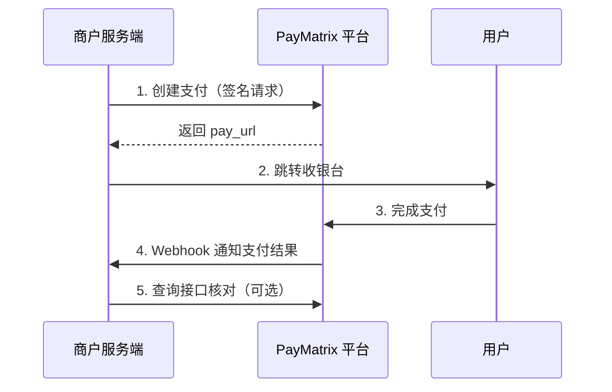

欢迎使用 PayMatrix 开放平台。本文档面向**商户服务端开发者**，说明如何通过 OpenAPI 完成支付接入。

## 接入前准备

在商户门户完成以下配置：

| 配置项 | 说明 |
| --- | --- |
| 商户 ID | 平台分配，请求头 `X-Merchant-Id` 使用 |
| RSA 公钥 | 商户生成密钥对，将公钥上传至门户 |
| IP 白名单 | 可选，限制只有指定出口 IP 可调用 API |
| Webhook | 配置回调 URL 与 Secret，接收支付结果通知 |

## 环境与地址

| 环境 | API 基础地址 |
| --- | --- |
| 生产 | `https://openapi.example.com/api` |
| 沙盒 | `https://sandbox-openapi.example.com/api` |

<Note>
  请将 `example.com` 替换为平台提供的实际域名。
</Note>

## 标准接入流程



1. **创建支付** — 调用 `POST /api/merchant/payment/create`，获取 `pay_url`
2. **引导支付** — 将用户跳转至 `pay_url` 完成付款
3. **接收通知** — 监听 Webhook 事件（如 `order.payment.succeeded`），更新订单状态
4. **主动查询** — 必要时调用 `GET /api/merchant/order/payment/query/{transactionId}` 做对账或补单
5. **发起退款** — 调用 `POST /api/merchant/payment/refund`

## 响应格式

所有 API 返回统一 JSON 结构：

```json
{
  "code": 200,
  "data": { },
  "msg": ""
}
```

| 字段 | 说明 |
| --- | --- |
| `code` | `200` 表示成功，其他值为错误码 |
| `data` | 业务数据，失败时可能为 `null` |
| `msg` | 错误描述，成功时通常为空 |

## 下一步

<CardGroup cols={2}>
  <Card title="签名与鉴权" icon="key" href="/integration/authentication">
    了解 RSA 签名规则与请求头要求
  </Card>
  <Card title="创建支付" icon="credit-card" href="/api/payment/create">
    查看创建支付接口参数与示例
  </Card>
  <Card title="Webhook 回调" icon="webhook" href="/api/webhook/overview">
    配置并验签平台推送的事件通知
  </Card>
  <Card title="订单查询" icon="magnifying-glass" href="/api/payment/query">
    主动查询支付与退款状态
  </Card>
</CardGroup>
