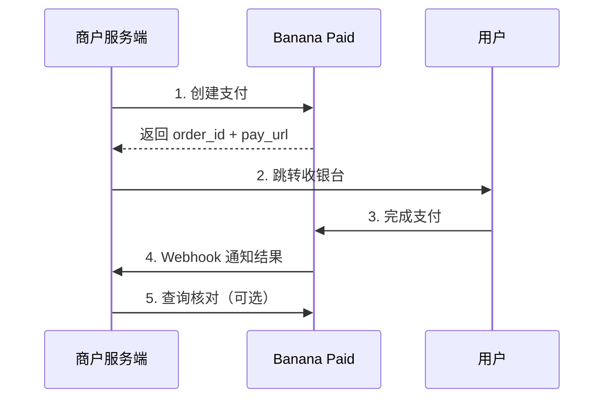

Banana Paid 是一站式收款平台，帮助商户接受、管理并结算多币种支付。你只需接入一次，即可获得完整的收银、对账、结算与风控能力——底层支付处理由平台统一完成，对你透明。

## 核心能力

<CardGroup cols={2}>
  <Card title="托管收银台" icon="cart-shopping">
    平台托管的收银页面，商户跳转即可收款，无需处理卡信息与合规
  </Card>
  <Card title="OpenAPI" icon="server">
    创建支付、退款、查询等服务端接口，RSA 签名鉴权
  </Card>
  <Card title="Webhook 通知" icon="webhook">
    支付、退款、争议等事件实时推送到你的服务端
  </Card>
  <Card title="结算与对账" icon="scale-balanced">
    多币种账户、结算单与提现，配套对账能力
  </Card>
</CardGroup>

## 文档怎么读

本套文档分为两部分，按你的角色选择：

<CardGroup cols={2}>
  <Card title="帮助文档" icon="book-open" href="/onboarding/overview">
    **面向商户业务 / 运营。** 介绍入驻、商户门户使用，以及支付、结算等业务概念。不涉及代码。
  </Card>
  <Card title="商户接入" icon="code" href="/getting-started/quickstart">
    **面向开发者。** 从零跑通第一笔支付：签名鉴权、支付 API、收银台跳转、Webhook 接收。
  </Card>
</CardGroup>

| 你想…                         | 去这里                                        |
| ----------------------------- | --------------------------------------------- |
| 了解产品、注册入驻            | [入驻指南](/onboarding/overview)              |
| 在门户查订单、退款、结算      | [商户门户](/portal/dashboard)                 |
| 理解支付流程与结算规则        | [核心概念](/concepts/payment-flow)            |
| 用 API 对接，跑通第一笔支付   | [快速开始](/getting-started/quickstart)       |
| 查接口参数与错误码            | [支付 API](/api/payment/create)               |

## 一笔支付是怎么走的

1. 商户服务端 **创建支付**，拿到 `order_id` 与 `pay_url`
2. 把用户 **跳转到 `pay_url`** 完成付款
3. 平台通过 **Webhook** 通知支付结果（权威来源）
4. 需要时用 `order_id` **主动查询** 对账；如需退款按 `order_id` 发起

准备好开始了吗？业务/运营从 [入驻指南](/onboarding/overview) 开始，开发者前往 [接入指引](/getting-started/quickstart)。
