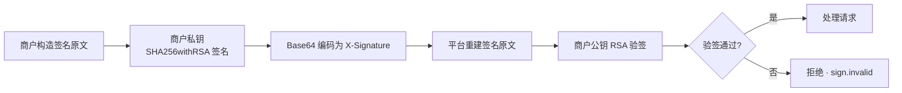

PayMatrix OpenAPI 采用 **RSA 签名 + 防重放** 机制，确保请求来源可信、内容未被篡改。

## 签名流程概述



## 必填请求头

所有需要签名的接口必须携带以下 4 个请求头：

| Header           | 说明                         | 示例              |
| ---------------- | ---------------------------- | ----------------- |
| `X-Merchant-Id`  | 商户 ID（平台分配）          | `10001`           |
| `X-Timestamp`    | 请求时间戳（Unix 毫秒）      | `<CURRENT_UNIX_MS>` |
| `X-Nonce`        | 随机字符串，每次请求唯一     | `a3f7b2c1d4e5`    |
| `X-Signature`    | RSA 签名（Base64 编码）      | `dGhpcyBpcyBhbi...` |

## 签名原文构造

签名原文由 6 部分用 `\n` 逐行拼接：

```
HTTP_METHOD\n
REQUEST_URI\n
SORTED_QUERY_STRING\n
SHA256(BODY_CANONICAL_STRING)\n
TIMESTAMP\n
NONCE
```

### 各部分说明

| 部分                       | 说明                                                         |
| -------------------------- | ------------------------------------------------------------ |
| `HTTP_METHOD`              | 请求方法，如 `POST`、`GET`                                   |
| `REQUEST_URI`              | 请求路径，不含域名，如 `/api/merchant/payment/create`        |
| `SORTED_QUERY_STRING`      | Query 参数按 key 字母序升序拼接，无参数时为空行               |
| `SHA256(BODY_CANONICAL_STRING)` | 请求体规范化后的 SHA256 值（小写十六进制）              |
| `TIMESTAMP`                | Unix 毫秒时间戳，与 `X-Timestamp` 头一致                     |
| `NONCE`                    | 随机字符串，与 `X-Nonce` 头一致                              |

### Body 规范化

对于 JSON 请求体，平台会递归拍平为 `key=value&key=value` 格式再做 SHA256。每一层对象的 key 按字母序处理；数组按原有顺序处理；`null` 不参与签名。**嵌套对象的 key 不带父级前缀，直接平铺**（如 `shipping.address.city` 拍平后为 `city=...`，而非 `shipping.address.city=...`）。不要直接对原始 JSON 文本做 SHA256——建议直接复用下方示例中的签名助手，以确保与平台拍平规则完全一致。

```json
// 原始请求体
{
  "amount": 100,
  "currency_code": "USD"
}

// 拍平后
amount=100&currency_code=USD

// 签名原文中该行
SHA256("amount=100&currency_code=USD")
// = "8f2c1d..."
```

对于 GET 请求无 Body 时，该行保留空行。

### 签名原文示例

```
POST
/api/merchant/payment/create

8f2c1d3a5b7e9f...
<CURRENT_UNIX_MS>
a3f7b2c1d4e5
```

## 签名算法

使用 `SHA256WithRSA` 对签名原文进行签名，结果 Base64 编码：

```java
// 伪代码
String canonicalString = buildCanonicalString(method, uri, queryString, body, timestamp, nonce);
Signature signature = Signature.getInstance("SHA256withRSA");
signature.initSign(privateKey);
signature.update(canonicalString.getBytes(StandardCharsets.UTF_8));
byte[] signBytes = signature.sign();
String signBase64 = Base64.getEncoder().encodeToString(signBytes);
```

## 防重放机制

平台对每个请求进行防重放校验：

- **时间窗**：`X-Timestamp` 与服务器时间偏差不超过 ±2 分钟
- **Nonce 去重**：同一商户 ID + Nonce 组合在 5 分钟内不可重复使用

超出时间窗返回 `1001029 auth.timestamp.expired`；重复 Nonce 返回 `1000 error.busy`。

## 请求体格式约定

请求体支持两种格式：

### 方式一：直接传业务参数

```json
{
  "amount": 100,
  "currency_code": "USD"
}
```

### 方式二：包裹在 `data` 字段中

```json
{
  "data": {
    "amount": 100,
    "currency_code": "USD"
  }
}
```

<Warning>
  `data` 只是业务参数的可选包装层。签名始终按本页的**递归规范化规则**计算，而不是对原始 JSON 字符串或外层 `data` 字段直接求哈希。为避免实现差异，新接入建议直接传业务参数；如需使用 `data` 包裹，请使用下一页提供的 helper。
</Warning>

## 可运行的签名实现

签名最容易因 Body 规范化不一致而失败。请不要根据伪代码自行补全实现，直接使用 [签名工具与示例](/integration/sdk) 中的 Java、Node.js 或 Python helper；该页的实现与服务端规则一致，并包含端到端调用示例。

## cURL 示例

```bash
curl -X POST "https://openapi.paymatrixpay.com/api/merchant/payment/create" \
  -H "Content-Type: application/json" \
  -H "X-Merchant-Id: 10001" \
  -H "X-Timestamp: <CURRENT_UNIX_MS>" \
  -H "X-Nonce: <UNIQUE_NONCE>" \
  -H "X-Signature: dGhpcyBpcyBhbiBleGFtcGxl..." \
  -d '{
    "merchant_order_no": "ORD-20260201-0001",
    "amount": 100.00,
    "currency_code": "USD",
    "redirect_url": "https://merchant.com/payment/return",
    "cancel_url": "https://merchant.com/payment/cancel",
    "products": [
      {
        "product_id": "PROD001",
        "name": "Product Name",
        "price": 100.00,
        "quantity": 1,
        "url": "https://merchant.com/product/PROD001"
      }
    ],
    "shipping": {
      "name": "Jane Smith",
      "address": {
        "line1": "1 Market Street",
        "city": "San Francisco",
        "state": "CA",
        "country": "US",
        "postal_code": "94105"
      }
    },
    "customer": {
      "full_name": "John Doe"
    }
  }'
```

## 常见问题

### 签名验证失败？

1. 确认 `X-Timestamp` 和 `X-Nonce` 的值与签名原文中一致，且在发送前即时生成
2. 确认公钥已正确上传至平台
3. 确认签名原文中的换行符为 `\n`（不是 `\r\n`）
4. 确认 Body 部分是对**规范化后的请求体**做 SHA256，而不是对原始 JSON 文本做 SHA256
5. 检查时间戳是否在 ±2 分钟窗口内

## 相关页面

- [接入概览](/integration/overview) — 完整安全机制说明
- [IP 白名单](/integration/ip-whitelist) — 额外安全防护
- [创建支付](/api/payment/create) — 带签名的接口示例
- [错误码参考](/appendix/errors) — 签名相关错误码
