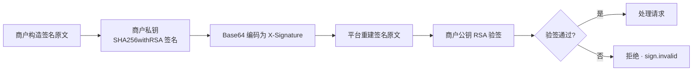

Banana Paid OpenAPI 采用 **RSA 签名 + 防重放** 机制，确保请求来源可信、内容未被篡改。

## 签名流程概述


```mermaid
flowchart LR
    A[商户构造签名原文] --> B[商户私钥<br/>SHA256withRSA 签名]
    B --> C[Base64 编码为 X-Signature]
    C --> D[平台重建签名原文]
    D --> E[商户公钥 RSA 验签]
    E --> F{验签通过?}
    F -->|是| G[处理请求]
    F -->|否| H[拒绝 · sign.invalid]
```

## 必填请求头

所有需要签名的接口必须携带以下 4 个请求头：

| Header           | 说明                         | 示例              |
| ---------------- | ---------------------------- | ----------------- |
| `X-Merchant-Id`  | 商户 ID（平台分配）          | `10001`           |
| `X-Timestamp`    | 请求时间戳（Unix 毫秒）      | `<CURRENT_UNIX_MS>` |
| `X-Nonce`        | 随机字符串，每次请求唯一     | `a3f7b2c1d4e5`    |
| `X-Signature`    | RSA 签名（Base64 编码）      | `dGhpcyBpcyBhbi...` |

## 签名原文构造

签名原文由 6 部分用 `\n` 逐行拼接：

```
HTTP_METHOD\n
REQUEST_URI\n
SORTED_QUERY_STRING\n
SHA256(BODY_CANONICAL_STRING)\n
TIMESTAMP\n
NONCE
```

### 各部分说明

| 部分                       | 说明                                                         |
| -------------------------- | ------------------------------------------------------------ |
| `HTTP_METHOD`              | 请求方法，如 `POST`、`GET`                                   |
| `REQUEST_URI`              | 请求路径，不含域名，如 `/api/merchant/payment/create`        |
| `SORTED_QUERY_STRING`      | Query 参数按 key 字母序升序拼接，无参数时为空行               |
| `SHA256(BODY_CANONICAL_STRING)` | 请求体规范化后的 SHA256 值（小写十六进制）              |
| `TIMESTAMP`                | Unix 毫秒时间戳，与 `X-Timestamp` 头一致                     |
| `NONCE`                    | 随机字符串，与 `X-Nonce` 头一致                              |

### Query 参数规范化

`SORTED_QUERY_STRING` 只处理 URL 中 `?` 后面的 Query 参数，与请求方法无关：

1. 按参数名的 Java 字符串自然顺序（UTF-16 code unit）升序排列。现有接口字段名均为 ASCII 字符，因此等价于 ASCII 升序。
2. 按 `key=value` 拼接多个参数，并使用 `&` 连接。
3. 签名时使用服务器解析后的参数名和值，不对它们再次 URL 编码。
4. 没有 Query 参数时，第三行是空行，但不能删除这一行。

例如，实际请求是：

```http
POST /api/merchant/payment/create?version=2&channel=card
```

第三行是：

```text
channel=card&version=2
```

<Warning>
  同一个 Query 参数名不要重复出现。平台只取该参数的一个值参与签名，重复参数在不同 HTTP 客户端和服务器中的取值行为可能不同。
</Warning>

### Body 规范化

POST、PUT 或 PATCH 的 JSON 放在 HTTP Body 中。实际发送的 JSON 字段顺序没有要求；平台解析 JSON 后按下面的规则生成 `BODY_CANONICAL_STRING`：

1. 从最外层对象开始处理。
2. 每一层对象的 key 按 Java 字符串自然顺序（UTF-16 code unit）升序排列。现有接口字段名均为 ASCII 字符，因此等价于 ASCII 升序。
3. 按排序后的顺序深度优先遍历；遇到嵌套对象时，先完整处理该对象，再处理下一个同级 key。
4. 标量字段输出为 `key=value`，多个字段使用 `&` 连接。
5. 嵌套 key 不带父级前缀。例如 `shipping.address.city` 输出为 `city=...`。
6. 对象数组保持原有元素顺序；每个数组元素按同一套对象规则递归处理，不添加数组下标。
7. `null` 不参与签名。
8. 最后计算 `SHA256(BODY_CANONICAL_STRING)`，输出小写十六进制摘要。

例如：

```json
{
  "shipping": {
    "name": "Zhang San",
    "address": {
      "line1": "No.123 Street",
      "city": "Guangzhou",
      "state": "Guangdong",
      "country": "CN",
      "postal_code": "510000",
      "line2": "Room 401"
    }
  }
}
```

`shipping` 内部排序后是 `address`、`name`，所以要先完整处理 `address`，最后处理 `name`：

```text
city=Guangzhou&country=CN&line1=No.123 Street&line2=Room 401&postal_code=510000&state=Guangdong&name=Zhang San
```

对应的 SHA-256 小写十六进制值是：

```text
3700b81a05b325f430f69d44a947e299faf8763bbf72593acc46f5e89d6126ad
```

对象数组示例：

```json
{
  "products": [
    { "name": "Second", "quantity": 2 },
    { "name": "First", "quantity": 1 }
  ]
}
```

数组不会按 `name` 重新排序，结果是：

```text
name=Second&quantity=2&name=First&quantity=1
```

<Warning>
  当前签名规范只支持数组中的对象。字符串、数字、布尔值等标量数组元素不会进入签名；请不要在需要签名的业务请求中使用标量数组。嵌套 key 不带父级前缀，因此也不要在不同对象中使用会产生歧义的同名叶子 key。
</Warning>

请使用接口定义中的 ASCII 字段名，不要自行添加非 ASCII JSON key 或 Query 参数名，否则不同语言的默认字符串排序规则可能不同。

Body 中的字符串值按原文拼接，不再次 URL 编码。数字和布尔值按平台解析 JSON 后的文本形式参与签名。为了避免 `100`、`100.0`、`100.00` 等表示方式在不同语言中产生差异，请只序列化一次 JSON，并将同一份 Body 同时用于签名和发送；金额不要使用多余尾零。

没有 Body 时，第四行是空行。注意，空 Body 与 `{}` 不同：`{}` 会得到空的 `BODY_CANONICAL_STRING`，第四行是 `SHA256("")` 的结果。

<Tip>
  Query 与 Body 可以同时存在。Query 进入第三行，规范化 Body 的 SHA-256 进入第四行，两者都参与签名。
</Tip>

### 签名原文示例

```
POST
/api/merchant/payment/create

3700b81a05b325f430f69d44a947e299faf8763bbf72593acc46f5e89d6126ad
<CURRENT_UNIX_MS>
a3f7b2c1d4e5
```

## 签名算法

使用 `SHA256WithRSA` 对签名原文进行签名，结果 Base64 编码：

```java
// 伪代码
String canonicalString = buildCanonicalString(method, uri, queryString, body, timestamp, nonce);
Signature signature = Signature.getInstance("SHA256withRSA");
signature.initSign(privateKey);
signature.update(canonicalString.getBytes(StandardCharsets.UTF_8));
byte[] signBytes = signature.sign();
String signBase64 = Base64.getEncoder().encodeToString(signBytes);
```

## 防重放机制

平台对每个请求进行防重放校验：

- **时间窗**：`X-Timestamp` 与服务器时间偏差不超过 ±2 分钟
- **Nonce 去重**：同一商户 ID + Nonce 组合在 5 分钟内不可重复使用

超出时间窗返回 `1001029 auth.timestamp.expired`；重复 Nonce 返回 `1000 error.busy`。

## 请求体格式约定

请求体支持两种格式：

### 方式一：直接传业务参数

```json
{
  "amount": 100,
  "currency_code": "USD"
}
```

### 方式二：包裹在 `data` 字段中

```json
{
  "data": {
    "amount": 100,
    "currency_code": "USD"
  }
}
```

<Warning>
  `data` 只是业务参数的可选包装层。签名始终按本页的**递归规范化规则**计算，而不是对原始 JSON 字符串或外层 `data` 字段直接求哈希。为避免实现差异，新接入建议直接传业务参数；如需使用 `data` 包裹，请使用下一页提供的 helper。
</Warning>

## 可运行的签名实现

签名最容易因 Body 规范化不一致而失败。请不要根据伪代码自行补全实现，直接使用 [签名工具与示例](/integration/sdk) 中的 Java、Node.js 或 Python helper；该页的实现与服务端规则一致，并包含端到端调用示例。

## cURL 示例

```bash
curl -X POST "https://openapi.bananapaid.com/api/merchant/payment/create" \
  -H "Content-Type: application/json" \
  -H "X-Merchant-Id: 10001" \
  -H "X-Timestamp: <CURRENT_UNIX_MS>" \
  -H "X-Nonce: <UNIQUE_NONCE>" \
  -H "X-Signature: dGhpcyBpcyBhbiBleGFtcGxl..." \
  -d '{
    "merchant_order_no": "ORD-20260201-0001",
    "amount": 100.00,
    "currency_code": "USD",
    "redirect_url": "https://merchant.com/payment/return",
    "cancel_url": "https://merchant.com/payment/cancel",
    "products": [
      {
        "product_id": "PROD001",
        "name": "Product Name",
        "price": 100.00,
        "quantity": 1,
        "url": "https://merchant.com/product/PROD001"
      }
    ],
    "shipping": {
      "name": "Jane Smith",
      "address": {
        "line1": "1 Market Street",
        "city": "San Francisco",
        "state": "CA",
        "country": "US",
        "postal_code": "94105"
      }
    },
    "customer": {
      "full_name": "John Doe"
    }
  }'
```

## 常见问题

### 实际发送的 JSON Body 需要先排序吗？

不需要。JSON 字段可以保持业务代码生成的顺序。你只需要在计算签名时解析同一份 Body，并按本页规则生成 `BODY_CANONICAL_STRING`。

### POST 有 Body、没有 Query 时，第三行还要保留吗？

要保留。第三行是空字符串，第四行是 Body 摘要。六行结构不能因为某一部分为空而缩减。

### 请求同时有 Query 和 Body 时怎么签名？

两者都参与签名：规范化 Query 放第三行，规范化 Body 的 SHA-256 放第四行。`REQUEST_URI` 只包含路径，不包含 `?` 及其后的 QueryString。

### 数组怎样参与签名？

对象数组保持原顺序，不添加索引；每个对象内部仍按 key 排序并深度优先展开。标量数组元素当前不会进入签名，请不要使用标量数组传递需要防篡改的业务参数。

### 签名验证失败？

1. 确认 `X-Timestamp` 和 `X-Nonce` 的值与签名原文中一致，且在发送前即时生成
2. 确认公钥已正确上传至平台
3. 确认签名原文中的换行符为 `\n`（不是 `\r\n`）
4. 确认 Body 部分是对**规范化后的请求体**做 SHA256，而不是对原始 JSON 文本做 SHA256
5. 检查时间戳是否在 ±2 分钟窗口内

## 相关页面

- [接入概览](/integration/overview) — 完整安全机制说明
- [IP 白名单](/integration/ip-whitelist) — 额外安全防护
- [创建支付](/api/payment/create) — 带签名的接口示例
- [错误码参考](/appendix/errors) — 签名相关错误码
