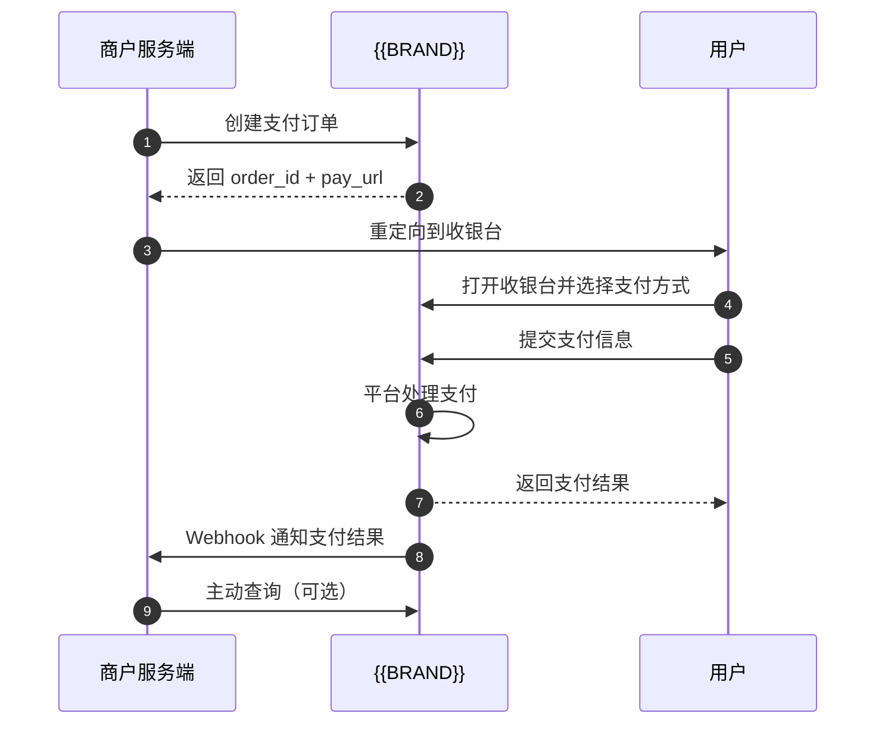
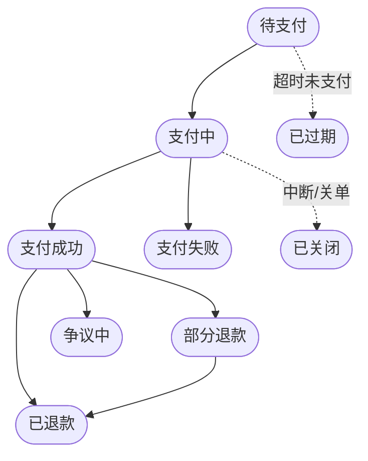

本文介绍一笔支付从发起到完成的完整流程。

## 流程总览

## 各阶段说明

### 1. 商户创建支付订单

商户服务端调用 `POST /api/merchant/payment/create` 创建支付订单。

<Info>
  **请求参数包含：** 商户订单号、订单金额与币种、商品信息、收货与客户信息、跳转地址
</Info>

平台返回 `order_id`（平台订单号）和 `pay_url`（收银台地址），引导用户支付。

### 2. 商户重定向消费者

商户将消费者浏览器重定向到 `pay_url`（或在自己的页面中嵌入 iframe）。

### 3. 收银台加载

消费者打开收银台页面后：
1. 收银台根据订单信息加载可用的支付方式
2. 展示支付金额、商品摘要等信息
3. 消费者选择合适的支付方式

### 4. 支付方式

<CardGroup cols={3}>
  <Card title="银行卡" icon="credit-card">
    支持主流银行卡
  </Card>
  <Card title="电子钱包" icon="wallet">
    支持主流电子钱包
  </Card>
  <Card title="本地支付" icon="building-columns">
    支持多种本地支付方式
  </Card>
</CardGroup>

<Note>
  具体可用的支付方式由平台按订单币种、地区等自动决定，商户无需关心底层如何处理。
</Note>

### 5. 消费者提交支付

消费者在收银台按所选支付方式完成支付。平台自动呈现对应的支付界面并采集所需信息，商户无需介入。

### 6. 平台处理支付

平台完成支付处理后，接收到最终支付结果，并据此更新订单状态。整个处理过程对商户透明。

### 7. 商户 Webhook 通知

平台确认支付结果后，向商户配置的 Webhook 地址推送事件：
- `order.payment.succeeded` — 支付成功
- `order.payment.failed` — 支付失败

### 8. 商户主动查询（可选）

商户也可以用平台订单号 `order_id` 调用 `GET /api/merchant/order/payment/query/{orderId}` 主动查询支付状态。

## 支付状态流转

<Note>
  完整的状态码、状态含义与流转规则见 [订单生命周期](/concepts/order-lifecycle)。
</Note>

## 超时处理

- 待支付订单有有效期，超过有效期仍未支付将自动置为 **已过期（EXPIRED）**；支付中断或关单则为 **已关闭（CLOSE）**
- 建议商户在 `pay_url` 页面提示用户支付有效期

## 幂等性

- 同一 `merchant_order_no` 不可重复创建支付，重复请求返回 `1001005 order.already.exists`
- 如下单超时未收到响应，请先用 [支付查询](/api/payment/query) 确认订单是否已创建，再决定是否重试，不要直接用同一订单号重试

## 相关页面

<CardGroup cols={2}>
  <Card title="创建支付 API" icon="credit-card" href="/api/payment/create">
    查看完整请求参数与代码示例
  </Card>
  <Card title="Webhook 通知" icon="webhook" href="/api/webhook/overview">
    接收支付结果异步通知
  </Card>
</CardGroup>
